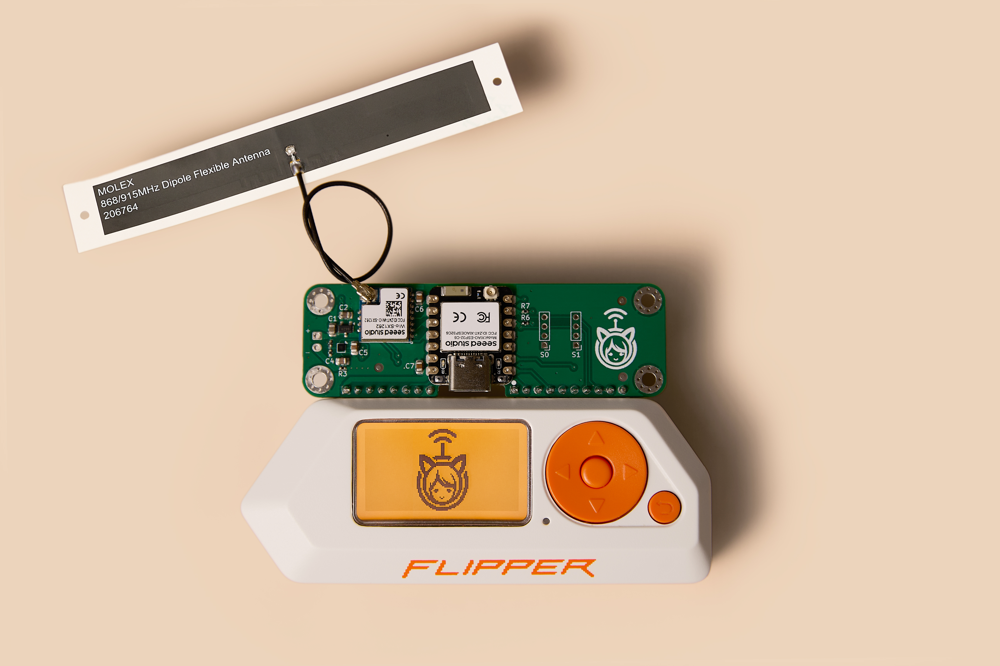

# Meshimi

**Open Source Multi-Protocol Wireless Module**

Meshimi empowers your Flipper Zero with advanced mesh networking capabilities, utilizing Meshtastic, LoRaWAN, WiFi6 and Bluetooth protocols.

## 📁 Repository Structure
- [`hardware/`](hardware) - PCB schematics, layouts, and production files
- [`mechanical/`](mechanical) - 3D models, enclosures, and assembly guides
- [`firmware/`](firmware) - Core firmware and Arduino examples
- [`software/`](software) - Flipper Zero app and configuration tools
- [`documentation/`](documentation) - Comprehensive guides and API reference
- [`assets/`](assets) - Logos, photos, and marketing materials

## 📖 Documentation

### 🛡️ Certifications
[CE and FCC certification files](documentation/certifications) from the manufacturer or vendor are available in the `/documentation/certifications` directory for reference and compliance.

1. [Seeed-XIAO-ESP32C6-CE-Verification.pdf](documentation/certifications/Seeed-XIAO-ESP32C6-CE-Verification.pdf)

2. [Seeed-XIAO-ESP32C6-EU-Declaration.pdf](documentation/certifications/Seeed-XIAO-ESP32C6-EU-Declaration.pdf)

3. [Seeed-XIAO-ESP32C6-FCC-Declaration.pdf](documentation/certifications/Seeed-XIAO-ESP32C6-FCC-Declaration.pdf)

4. [Seeed-XIAO-ESP32C6-TELEC-Certificate.pdf](documentation/certifications/Seeed-XIAO-ESP32C6-TELEC-Certificate.pdf)

5. [Seeed-XIAO-ESP32C6-UK-Declaration.pdf](documentation/certifications/Seeed-XIAO-ESP32C6-UK-Declaration.pdf)

6. [Seeed-XIAO-Series-RoHS-Certificate.pdf](documentation/certifications/Seeed-XIAO-Series-RoHS-Certificate.pdf)