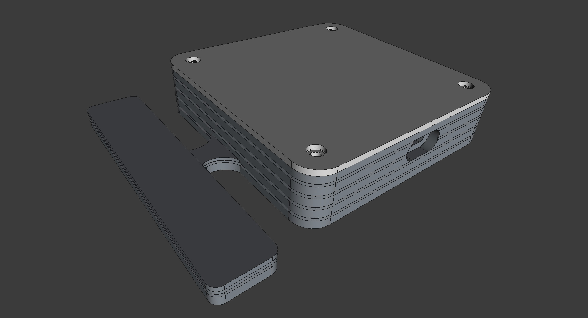
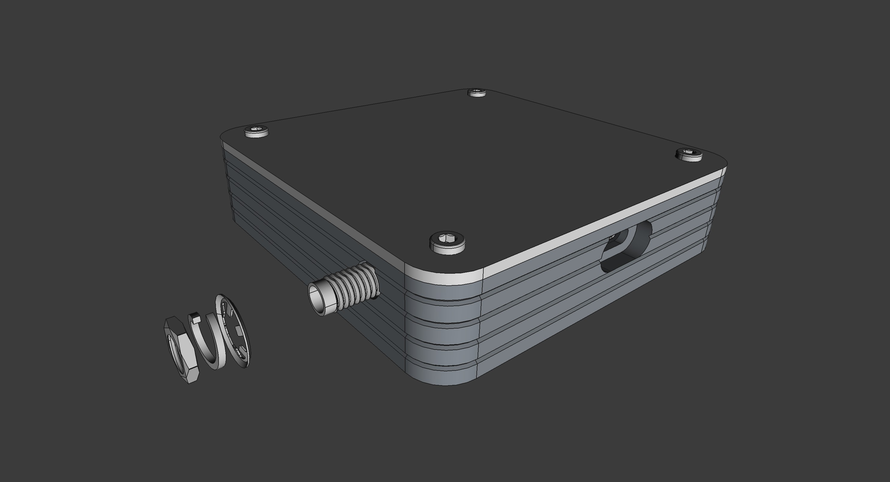
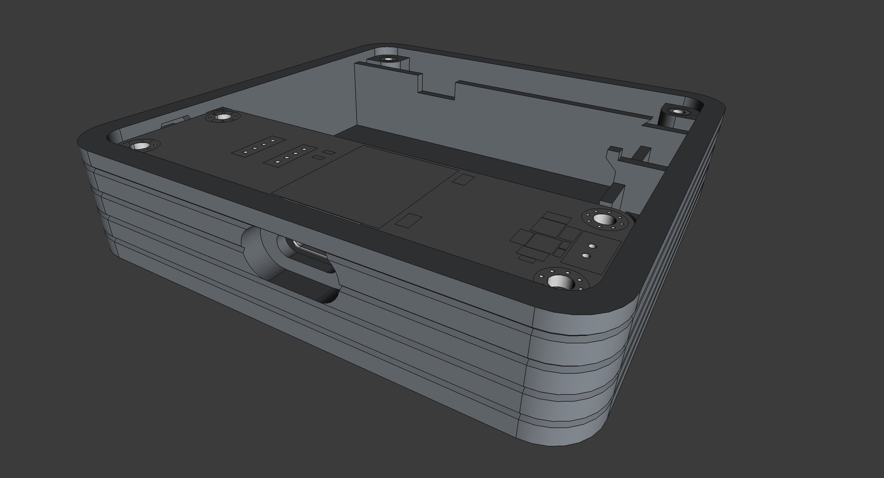

## Enclosures for the Meshimi Module

### Design with Built-in Antenna

Step file: [Meshimi_enclosure_with_builtin_antenna.step](../mechanical/enclosure/Meshimi_enclosure_with_builtin_antenna.step)

Optimized for 3D FDM printing, this enclosure is designed to accommodate the Meshimi module with an integrated antenna.

### Design with External Antenna

Step file: [Meshimi_enclosure_with_external_antenna.step](../mechanical/enclosure/Meshimi_enclosure_with_external_antenna.step)

This enclosure, optimized for 3D FDM printing, is designed to house the Meshimi module with an external antenna.

It features an SMA connector for attaching an external antenna, providing flexibility for various use cases and environments.

### Enclosure Assembly Guide

This enclosure is designed to house the Meshimi module and can be assembled by following these steps:
1. **Print the Enclosure**: Use a 3D printer to fabricate the enclosure files provided in the [enclosure](../mechanical/enclosure) directory.
2. **Insert Brass Heat Inserts**: Place brass heat inserts into the designated holes in the enclosure.
3. **Attach the Meshimi Module**: Secure the Meshimi module inside the enclosure using screws.

[//]: # (TODO: Improve the assembly guide with more detailed instructions and images.)